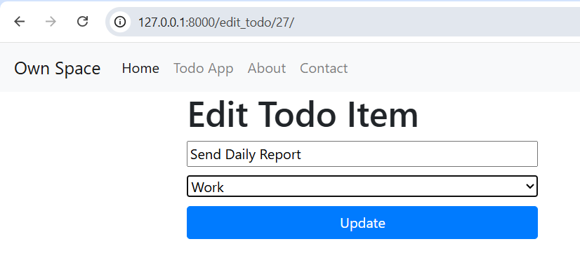

# Own Space – Django Todo App

A simple **Django-based Todo application** with category-based task organization created for **learning and practicing core Django concepts** such as models, views, templates, URL routing, and basic CRUD operations.

---

## Features

- Add new todo items with a selected category  
- Edit existing todo titles  
- Delete todos with a confirmation prompt  
- Mark todos as complete or incomplete  
- Completed todos are shown with a strike-through style  
- Category labels (e.g., Personal, Work, Learning) displayed as badges  
- Simple navigation bar with Home, Todo App, About, and Contact pages  
- Uses SQLite for local development  

---

## Tech Stack

- Python  
- Django  
- SQLite (development database)  
- HTML (Django Templates)

---

## Requirements

- Python 3.10+  
- Django  

---

## Setup (Windows)
1. Create and activate venv:
   - `python -m venv .venv`
   - `.venv\Scripts\activate`
2. Install dependencies:
   - `pip install django`
   - (or `pip install -r requirements.txt`)
3. Apply migrations:
   - `python manage.py migrate`
4. Run development server:
   - `python manage.py runserver`
5. Open http://127.0.0.1:8000/todos

---

## 🎯 Purpose

This project is built purely for learning and practice.
It is intended to strengthen understanding of Django fundamentals and is not production-ready.

## 📸 Screenshots

### Home Page
> Landing page with navigation links to Home, Todo App, About, and Contact.

---

### Todo List with Categories
> Main todo page showing tasks grouped with category badges and action icons.

---

### Delete Confirmation Dialog
> Browser confirmation prompt shown before deleting a todo item.

---

### Completed Todo Item
> Completed todos are visually marked with a strike-through style.

---

### Edit Todo Page
> Page used to edit an existing todo item.

---

### Edited Todo Item
> Updated todo title reflected after editing.

---

### About Page
> Static About page describing the application.

---

### Contact Page
> Static Contact page with basic contact information.

